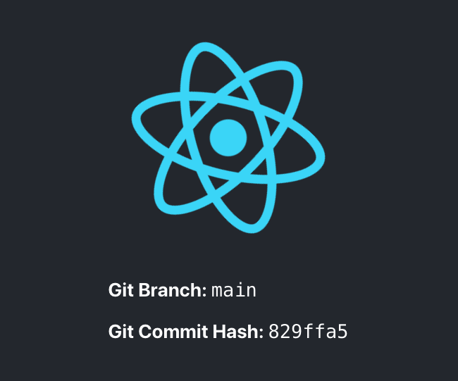

# Create React App: Show Current Git Branch and Commit Hash From Any OS

This project was bootstrapped with [Create React App](https://github.com/facebook/create-react-app).

## Sister Links

- **Article:** <https://zwbetz.com/create-react-app-show-current-git-branch-and-commit-hash-from-any-os/>

## Run it

1. Install NodeJS version 12 or higher
1. Run `npm install`
1. Run `npm start`

## Relevant Files

- `package.json`
- `src/gitInfo.js`
- `src/App.js`

## Screenshot

**Note:** The git commit hash in this screenshot will likely be an old one.
